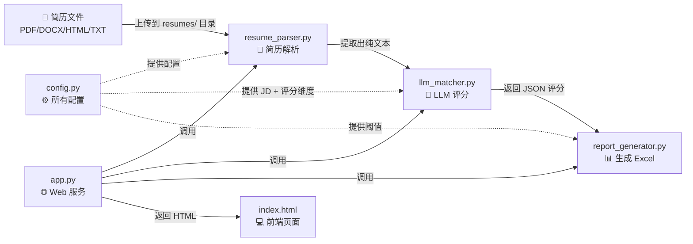
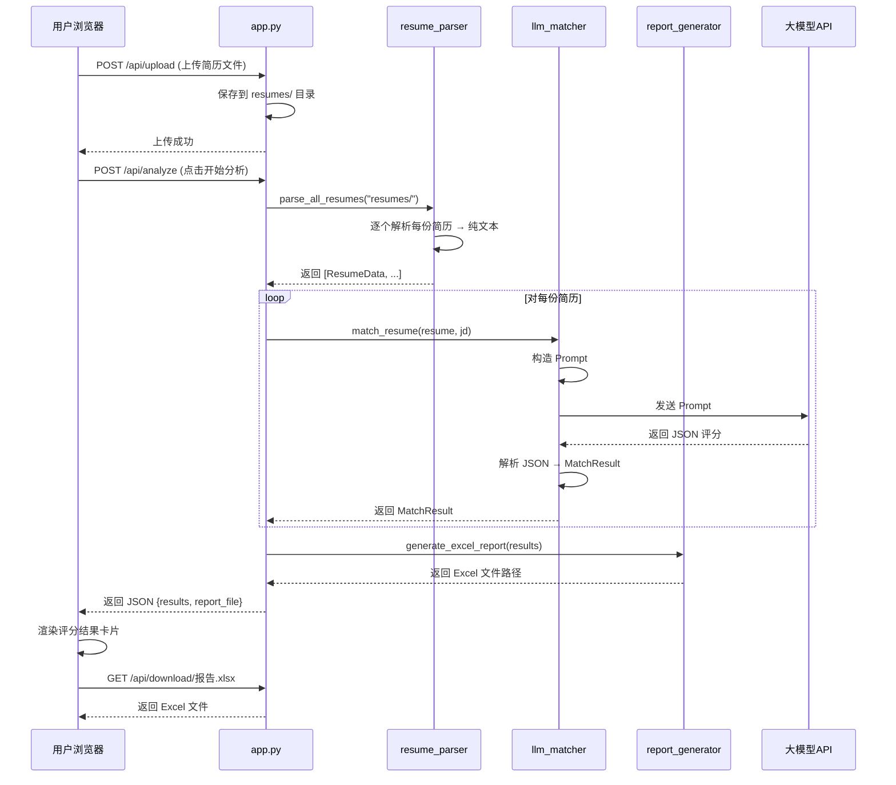
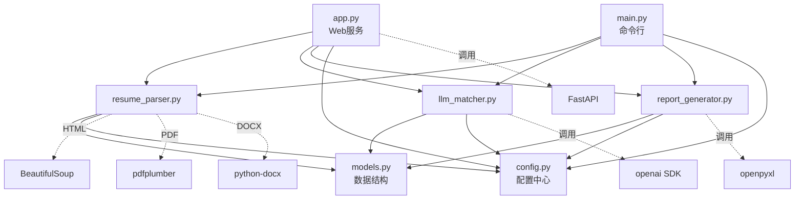

# 简历智能筛选系统 - 项目全解析

> 这份文档把整个项目掰碎了讲，让你能快速看懂每个文件在干什么、数据怎么流转、代码怎么抄。

---

## 一、项目整体架构（一张图看懂）



**一句话总结**：用户上传简历 → 解析成文本 → 丢给大模型打分 → 生成报告。

---

## 二、文件职责一览表

| 文件 | 干什么的 | 核心函数 |
|------|---------|---------|
| `config.py` | 所有配置集中管理 | 直接改变量即可 |
| `models.py` | 定义数据结构 | `ResumeData`, `MatchResult` |
| `resume_parser.py` | 把各种格式简历变成纯文本 | `parse_resume()`, `parse_all_resumes()` |
| `llm_matcher.py` | 把简历文本发给大模型打分 | `match_resume()`, `batch_match()` |
| `report_generator.py` | 把评分结果生成 Excel | `generate_excel_report()` |
| `app.py` | FastAPI 网页服务 | 各种 API 路由 |
| `main.py` | 命令行入口 | `main()` |
| `templates/index.html` | 前端页面（单文件） | JavaScript 函数 |
| `create_test_resumes.py` | 生成测试简历 | 只在开发时用 |

---

## 三、每个文件详解

---

### 📄 文件 1：`config.py` — 配置中心

**作用**：所有可调参数都在这里，改需求只改这个文件。

```python
# === LLM 配置 ===
LLM_BASE_URL = "http://localhost:11434/v1"   # 大模型的地址
LLM_API_KEY = "sk-no-key-required"           # API 密钥（本地的不需要）
LLM_MODEL_NAME = "deepseek-chat"             # 模型名称

# === 文件路径 ===
RESUME_DIR = "resumes"    # 简历放这个文件夹
OUTPUT_DIR = "output"     # 报告输出到这

# === 岗位要求 (JD) ===
JOB_DESCRIPTION = """
岗位名称：Python 后端开发工程师
任职要求：
1. 本科及以上学历...
2. 3年以上 Python 后端开发经验...
"""

# === 评分维度（权重加起来 = 100） ===
SCORING_DIMENSIONS = [
    {"name": "技能匹配", "weight": 30, "description": "技术栈匹配程度"},
    {"name": "工作经验", "weight": 25, "description": "工作经验年限和质量"},
    {"name": "教育背景", "weight": 15, "description": "学历匹配度"},
    {"name": "项目经历", "weight": 20, "description": "项目相关性"},
    {"name": "综合素质", "weight": 10, "description": "沟通能力等"},
]

# === 推荐阈值 ===
RECOMMEND_THRESHOLD = 70    # >= 70 推荐面试
MAYBE_THRESHOLD = 50        # 50-69 待定
# < 50 不推荐
```

> [!TIP]
> **甲方要改岗位要求？** → 改 `JOB_DESCRIPTION`  
> **要改评分标准？** → 改 `SCORING_DIMENSIONS`  
> **要换模型？** → 改 `LLM_BASE_URL` 和 `LLM_MODEL_NAME`

---

### 📄 文件 2：`models.py` — 数据结构

**作用**：定义了两个核心数据容器，所有模块都依赖它。

```python
@dataclass
class ResumeData:
    """一份简历被解析后长这样"""
    file_path: str          # 文件路径
    file_name: str          # 文件名
    raw_text: str           # ⭐ 核心：简历的全部文本内容
    name: str = None        # 姓名（正则提取，可能为空）
    phone: str = None       # 手机号
    email: str = None       # 邮箱
    education: str = None   # 学历
    work_years: str = None  # 工作年限
    skills: list = []       # 技能列表

@dataclass
class MatchResult:
    """LLM 评完分后长这样"""
    resume: ResumeData          # 对应的简历
    total_score: int = 0        # 总分 0-100
    recommendation: str = ""    # "推荐面试" / "可以考虑" / "不推荐"
    dimensions: list = []       # 各维度评分 [{name, score, comment}]
    strengths: str = ""         # 优势
    weaknesses: str = ""        # 不足
    overall_comment: str = ""   # 总评
    error: str = None           # 出错信息
```

**数据流向**：
```
简历文件 → parse_resume() → ResumeData → match_resume() → MatchResult → 生成报告
```

---

### 📄 文件 3：`resume_parser.py` — 简历解析

**作用**：把 PDF/DOCX/HTML/TXT 文件 → 纯文本字符串。

**核心逻辑只有 3 步**：

```
第1步：根据文件后缀，选对应的解析器
第2步：解析器把文件内容转成纯文本
第3步：用正则提取手机号、邮箱等基本信息
```

**关键代码解读**：

```python
def parse_resume(file_path):
    ext = Path(file_path).suffix.lower()  # 取后缀 .pdf / .docx / .html / .txt
    
    # 第1步：选解析器（字典分发，很经典的写法）
    parsers = {
        ".html": _parse_html,    # 用 BeautifulSoup
        ".pdf":  _parse_pdf,     # 用 pdfplumber
        ".docx": _parse_docx,    # 用 python-docx
        ".doc":  _parse_doc,     # 用 antiword 或暴力提取
        ".txt":  _parse_txt,     # 直接读文件
    }
    parser = parsers[ext]
    
    # 第2步：解析
    raw_text = parser(file_path)
    
    # 第3步：构建 ResumeData，顺便用正则提取基本信息
    resume = ResumeData(file_path=file_path, file_name=..., raw_text=raw_text)
    _extract_basic_info(resume)  # 正则提取手机号、邮箱、学历
    return resume
```

**各解析器干了什么**：

| 格式 | 解析器 | 用的库 | 原理 |
|------|--------|--------|------|
| `.html` | `_parse_html()` | BeautifulSoup | 去掉标签，取纯文本 |
| `.pdf` | `_parse_pdf()` | pdfplumber | 逐页提取文本 |
| `.docx` | `_parse_docx()` | python-docx | 提取段落 + 表格文本 |
| `.doc` | `_parse_doc()` | antiword/暴力 | 尝试命令行工具，失败则暴力提取 |
| `.txt` | `_parse_txt()` | 内置 open | 尝试 utf-8/gbk 编码读取 |

> [!IMPORTANT]
> **前程无忧下载的简历通常是 HTML 格式**，所以 `_parse_html()` 是最常用的解析器。

**正则提取部分**（`_extract_basic_info`）：

```python
# 手机号：1开头11位数字
phone_match = re.search(r'1[3-9]\d{9}', text)

# 邮箱：xxx@xxx.xxx
email_match = re.search(r'[\w.+-]+@[\w-]+\.[\w.]+', text)

# 姓名：第一行如果是2-4个汉字，就当是名字
if 2 <= len(first_line) <= 4 and re.match(r'^[\u4e00-\u9fff]+$', first_line):
    resume.name = first_line

# 学历：找关键词
for keyword in ["博士", "硕士", "本科", "大专"]:
    if keyword in text:
        resume.education = keyword
```

---

### 📄 文件 4：`llm_matcher.py` — LLM 评分（核心）

**作用**：把简历文本 + JD 发给大模型，让它打分，解析返回的 JSON。

**核心流程**：

```
构造 Prompt → 调用大模型 API → 解析返回的 JSON → 计算加权总分 → 给出推荐等级
```

**第1步：构造 Prompt**（`_build_prompt` 函数）

```python
prompt = f"""你是一位专业的 HR 招聘顾问...

## 岗位要求 (JD)
{job_description}          # ← 从 config.py 来的

## 候选人简历
{resume_text[:6000]}       # ← 简历文本，截断 6000 字

## 评分要求
请从以下维度评分（每个维度 0-100 分）：
  - 技能匹配（权重30%）
  - 工作经验（权重25%）
  - ...

## 输出格式
请严格按以下 JSON 格式输出：
{{
  "candidate_name": "姓名",
  "dimensions": [
    {{"name": "技能匹配", "score": 80, "comment": "评语"}},
    ...
  ],
  "strengths": "优势",
  "weaknesses": "不足",
  "overall_comment": "总评"
}}
"""
```

**第2步：调用大模型**（`match_resume` 函数）

```python
# 用的是 OpenAI 的标准 SDK，DeepSeek/本地模型都兼容
client = OpenAI(base_url=config.LLM_BASE_URL, api_key=config.LLM_API_KEY)

response = client.chat.completions.create(
    model=config.LLM_MODEL_NAME,
    messages=[
        {"role": "system", "content": "你是专业的 HR 招聘评估顾问..."},
        {"role": "user", "content": prompt},
    ],
    temperature=0.1,        # 低温度 = 结果更稳定
    max_tokens=2000,
)

content = response.choices[0].message.content  # 拿到大模型返回的文本
```

**第3步：解析 JSON**（`_parse_llm_response` 函数）

```python
# 容错处理：大模型可能会在 JSON 前后加文字或 markdown 标记
if "```json" in content:
    json_str = content.split("```json")[1].split("```")[0]

data = json.loads(json_str)  # 解析 JSON
```

**第4步：计算加权总分**（`_calculate_weighted_score` 函数）

```python
# 权重从 config.SCORING_DIMENSIONS 来
# 例：技能80分×30% + 经验70分×25% + 学历60分×15% + 项目75分×20% + 综合70分×10%
weighted_sum = 0
for dim in dimensions:
    weight = weight_map[dim.name]  # 从配置取权重
    weighted_sum += dim.score * weight
total_score = weighted_sum / total_weight  # 加权平均
```

**第5步：判断推荐等级**

```python
if total_score >= 70:  推荐面试
elif total_score >= 50: 可以考虑
else:                  不推荐
```

**批量评分**（`batch_match` 函数）：

```python
def batch_match(resumes, job_description, progress_callback=None):
    results = []
    for i, resume in enumerate(resumes):
        result = match_resume(resume, job_description)  # 逐个评分
        results.append(result)
        time.sleep(1)  # 每份简历间隔 1 秒，避免压垮模型
    results.sort(key=lambda r: r.total_score, reverse=True)  # 按分数降序
    return results
```

---

### 📄 文件 5：`report_generator.py` — 报告生成

**作用**：把评分结果写成 Excel（用 openpyxl 库）。

生成两个 Sheet：

| Sheet | 内容 | 列 |
|-------|------|-----|
| 筛选总览 | 排名、姓名、总分、推荐等级、学历、工作年限、优势、不足、总评 | 9列 |
| 详细评分 | 排名、姓名、总分、推荐等级、各维度分数、文件名 | 动态列 |

**颜色规则**：
- 🟢 绿色底 = 推荐面试（≥70分）
- 🟡 黄色底 = 可以考虑（50-69分）
- 🔴 红色底 = 不推荐（<50分）

---

### 📄 文件 6：`app.py` — Web 服务

**作用**：FastAPI 提供 HTTP 接口 + 网页。

**所有 API 一览**：

| 方法 | 路径 | 干什么 |
|------|------|--------|
| GET | `/` | 返回前端页面 |
| POST | `/api/upload` | 上传简历文件 |
| GET | `/api/resumes` | 获取已上传的简历列表 |
| DELETE | `/api/resumes/{filename}` | 删除一份简历 |
| POST | `/api/analyze` | ⭐ 开始分析（调解析→评分→报告） |
| GET | `/api/download/{filename}` | 下载 Excel 报告 |
| GET | `/api/config` | 获取当前配置 |

**核心 API：`/api/analyze`** 的流程：

```python
@app.post("/api/analyze")
async def analyze_resumes(jd=None):
    # 1. 解析所有简历
    resumes = parse_all_resumes(config.RESUME_DIR)
    
    # 2. LLM 评分
    results = batch_match(resumes, job_description)
    
    # 3. 生成 Excel
    report_path = generate_excel_report(results, config.OUTPUT_DIR)
    
    # 4. 返回 JSON 给前端
    return {"results": [...], "report_file": "xxx.xlsx"}
```

**启动方式**：
```bash
python app.py
# 然后浏览器打开 http://localhost:8000
```

---

### 📄 文件 7：`main.py` — 命令行入口

**作用**：不用网页，直接在终端里跑。

```bash
# 基本用法
python main.py

# 指定简历目录
python main.py --dir /path/to/resumes

# 指定 JD 文件
python main.py --jd jd.txt

# 指定输出目录
python main.py --output /path/to/output
```

流程跟 `app.py` 一样，只是输出在终端（用 rich 库打印彩色表格）。

---

### 📄 文件 8：`templates/index.html` — 前端页面

**作用**：单文件前端，包含 HTML + CSS + JS。

**页面结构**：

```
┌─────────────────────────────────────────────────┐
│  📋 简历智能筛选系统              模型: deepseek │  ← 导航栏
├─────────────────────────────────────────────────┤
│  [📄 总数: 5]  [⭐ 推荐: 2]  [🔶 待定: 1]  [❌ 不推荐: 2]  │  ← 统计卡片
├──────────────┬──────────────────────────────────┤
│ 📤 上传简历   │  候选人1 ████████ 85分 ⭐推荐   │
│ [拖拽上传区]  │  候选人2 ██████── 68分 🔶待定   │  ← 左右布局
│              │  候选人3 ████──── 42分 ❌不推荐  │
│ 📝 岗位要求   │                                 │
│ [JD 文本框]   │  ← 点击展开可看详细维度分数     │
│              │                                 │
│ [🚀开始分析]  │                                 │
└──────────────┴──────────────────────────────────┘
```

**核心 JS 函数**：

| 函数 | 干什么 |
|------|--------|
| `init()` | 页面加载时初始化，获取配置和简历列表 |
| `uploadFiles(files)` | 上传文件到后端 |
| `loadResumes()` | 刷新简历文件列表 |
| `startAnalysis()` | 调用 /api/analyze，拿到结果后渲染 |
| `renderResults(results)` | 把评分结果渲染成候选人卡片 |
| `toggleDetail(index)` | 展开/收起候选人详情 |
| `downloadReport()` | 下载 Excel 报告 |

---

## 四、完整数据流（从上传到出报告）



---

## 五、快速上手指南（怎么跑起来）

### 第1步：安装依赖

```bash
pip install -r requirements.txt
# 或者用 conda
pip install fastapi uvicorn beautifulsoup4 pdfplumber python-docx lxml openai openpyxl rich
```

### 第2步：配置大模型

编辑 `config.py`，改这三行：

```python
# 如果用 Ollama 本地部署
LLM_BASE_URL = "http://localhost:11434/v1"
LLM_API_KEY = "sk-no-key-required"
LLM_MODEL_NAME = "deepseek-chat"

# 如果用 DeepSeek 官方 API
LLM_BASE_URL = "https://api.deepseek.com"
LLM_API_KEY = "sk-xxxxxx"   # 你的 API Key
LLM_MODEL_NAME = "deepseek-chat"

# 如果用 ChatGPT
LLM_BASE_URL = "https://api.openai.com/v1"
LLM_API_KEY = "sk-xxxxxx"
LLM_MODEL_NAME = "gpt-4o-mini"
```

### 第3步：改岗位要求

编辑 `config.py` 里的 `JOB_DESCRIPTION`，把甲方给的 JD 贴进去。

### 第4步：放入简历

把从前程无忧下载的简历文件（HTML/PDF/DOCX）放到 `resumes/` 文件夹。

### 第5步：启动

```bash
python app.py
# 打开浏览器访问 http://localhost:8000
```

---

## 六、常见修改场景（抄代码指南）

### 场景1：甲方要改评分维度

只改 `config.py`：

```python
SCORING_DIMENSIONS = [
    {"name": "Java技能", "weight": 35, "description": "Java相关技术栈"},
    {"name": "项目经验", "weight": 30, "description": "相关项目经验"},
    {"name": "学历", "weight": 15, "description": "学历要求"},
    {"name": "沟通能力", "weight": 20, "description": "软技能"},
]
```

### 场景2：甲方要改推荐标准

只改 `config.py`：

```python
RECOMMEND_THRESHOLD = 80    # 更严格：80分以上才推荐
MAYBE_THRESHOLD = 60        # 60-79 待定
```

### 场景3：要支持新的文件格式

在 `resume_parser.py` 加一个解析函数：

```python
def _parse_xxx(file_path):
    # 你的解析逻辑
    return text

# 然后在 parsers 字典里加一行
parsers = {
    ".html": _parse_html,
    ".xxx": _parse_xxx,   # ← 加这行
}
```

并在 `config.py` 的 `SUPPORTED_FORMATS` 里加上新格式。

### 场景4：要改 Prompt（让大模型评分更准）

改 `llm_matcher.py` 的 `_build_prompt()` 函数，修改里面的提示词文本。

### 场景5：要改 Excel 报告格式

改 `report_generator.py` 的 `_create_overview_sheet()` 和 `_create_detail_sheet()` 函数。

### 场景6：部署到服务器

```bash
# 1. 把整个项目复制到服务器
# 2. 安装依赖
pip install -r requirements.txt
# 3. 启动（0.0.0.0 让外网可访问）
python app.py
# 或者用 nohup 后台跑
nohup python app.py > log.txt 2>&1 &
```

---

## 七、依赖关系图



> 箭头 = import 依赖，虚线 = 第三方库依赖

---

## 八、一句话总结每个技术选型

| 选型 | 为什么选它 |
|------|-----------|
| FastAPI | Python 最快的 Web 框架，自带 API 文档 |
| OpenAI SDK | DeepSeek/ChatGPT/Ollama 都兼容这个接口 |
| BeautifulSoup | 解析 HTML 的标准库，前程无忧简历就是 HTML |
| pdfplumber | PDF 文本提取最好用的库 |
| python-docx | 读 .docx 文件的标准库 |
| openpyxl | 生成 Excel 的标准库，支持样式 |
| rich | 终端美化输出（彩色表格） |
